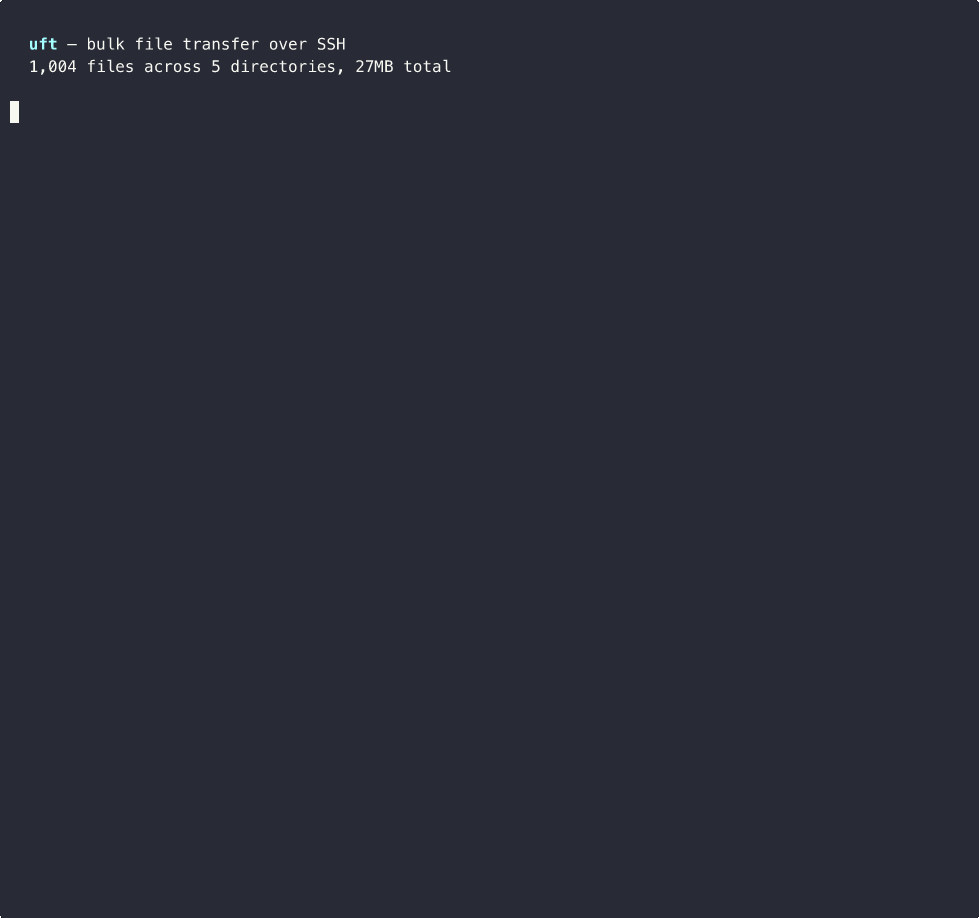

```
         _____ _____
 _ _ ___|_   _|     |
| | |  _| | | |-   -|
|___|_|   |_| |_____|

 ultrafast transfer
```

Bulk file transfer over SSH. Moves 100K-1M+ files fast.



---

## Why

scp and rsync open a separate channel for every file. On a link with 20ms
latency, transferring 100K files means 100K round-trips, over 30 minutes of
waiting before any data moves.

uft bundles everything into one tar stream. One pipe, zero per-file overhead.
Transfer time depends on data size and bandwidth, not file count.

## Install

```bash
brew install pavlyhalim/tap/uft
```

From source:

```bash
git clone https://github.com/pavlyhalim/uft.git && cd uft && make install
```

One-liner:

```bash
curl -fsSL https://raw.githubusercontent.com/pavlyhalim/uft/main/install.sh | bash
```

Speed tools (auto-detected, optional):

```bash
brew install lz4 pv          # macOS
sudo apt install lz4 pv      # Ubuntu/Debian
uft --setup                   # interactive check
```

## Usage

```bash
uft -H server.com -u deploy -r /data/frames -l ./frames
```

uft figures out the fastest method, picks the right cipher and compressor,
shows progress, and verifies the result.

```bash
# trusted network, maximum speed
uft -H 10.0.0.5 -u root -r /data -l ./data -m tar-nc -s 8

# resumable transfer with 16 workers
uft -H server.com -u admin -r /data -l ./data -m parallel-rsync -j 16

# resume after interruption
uft -H server.com -u admin -r /data -l ./data -m parallel-rsync --resume

# through a bastion host
uft -H internal.lan -u deploy -r /data -l ./data -J bastion.example.com

# skip .git and log files
uft -H srv -u deploy -r /data -l ./data --exclude '.git' --exclude '*.log'

# only files newer than a date
uft -H srv -u deploy -r /data -l ./data --newer '2025-06-01'

# benchmark your link first
uft -H server.com -u admin -r /data -l ./data -m benchmark

# dry run with time estimate
uft -H server.com -u admin -r /data -l ./data --dry-run
```

## Modes

| Mode | Encrypted | Resumable | Best for |
|:-----|:----------|:----------|:---------|
| tar-stream | yes | no | Bulk downloads, high file counts |
| tar-nc | no | no | Trusted networks, max throughput |
| parallel-rsync | yes | yes | Incremental sync, resumable transfers |

```
tar-stream:  remote: tar | lz4 --> SSH --> lz4 -d | tar :local
tar-nc:      remote: tar | lz4 --> TCP --> lz4 -d | tar :local
rsync:       N workers over one SSH mux, size-balanced bin-packing
```

Speed depends on your network. Run `uft -m benchmark` to measure your link.

## How it works

1. Checks SSH connectivity, scans the remote directory, checks disk space
2. Detects what tools are available on both ends
3. Picks the fastest transfer mode and runs it
4. Compares file counts and sizes to make sure nothing was lost

## Config file

Set defaults in `~/.uftrc` so you dont have to type flags every time.
CLI flags always take priority.

```ini
host = server.com
user = deploy
compress = lz4
jobs = 12
jump = bastion.example.com
exclude = *.log
exclude = .git
keep_logs = 30
```

All keys: host, user, remote_path, local_path, port, key, mode, compress,
jobs, streams, nc_port, verify, bwlimit, local_ip, symlinks, jump,
keep_logs, exclude (repeatable), exclude_from, newer, skip_scan.

## Flags

| Flag | What it does | Default |
|:-----|:------------|:--------|
| -H, --host | Remote hostname or IP | required |
| -u, --user | SSH username | required |
| -r, --remote-path | Source directory on remote | required |
| -l, --local-path | Local destination | required |
| -m, --mode | auto, tar-stream, tar-nc, parallel-rsync, benchmark | auto |
| -c, --compress | auto, lz4, pigz, zstd, gzip, none | auto |
| -j, --jobs | Parallel rsync workers | 8 |
| -s, --streams | Parallel netcat streams | 4 |
| -p, --port | SSH port | 22 |
| -k, --key | SSH key file | |
| -b, --bwlimit | Bandwidth cap in KB/s | |
| -J, --jump | SSH jump/bastion host | |
| --exclude | Exclude pattern, can repeat | |
| --exclude-from | Read exclude patterns from a file | |
| --copy-links | Follow symlinks instead of preserving them | off |
| --newer | Only transfer files newer than a date | |
| --skip-scan | Skip the remote file count and size scan | off |
| --keep-logs | Number of session logs to keep | 20 |
| --config | Path to config file | ~/.uftrc |
| --resume | Resume a previous interrupted transfer | |
| --checksum | Spot-check md5 on 100 random files after transfer | |
| --dry-run | Run preflight and estimate time without transferring | |
| --setup | Check whats installed and offer to install missing tools | |
| --tuning | Print network and kernel tuning tips | |
| -y, --yes | Skip confirmation prompts | |
| --version | Print version | |

## Environment variables

Every flag has a matching env var.

```bash
export UFT_HOST=server.com
export UFT_USER=deploy
uft -r /data -l ./data
```

Full list: UFT_HOST, UFT_USER, UFT_REMOTE, UFT_LOCAL, UFT_PORT, UFT_KEY,
UFT_MODE, UFT_COMPRESS, UFT_JOBS, UFT_STREAMS, UFT_VERIFY, UFT_JUMP,
UFT_NEWER, UFT_EXCLUDE_FROM, UFT_SKIP_SCAN, UFT_KEEP_LOGS, UFT_COPY_LINKS,
UFT_CONFIG.

## Requirements

- bash 4 or newer
- ssh and tar (always present on unix systems)
- lz4 recommended for faster compression
- pv recommended for progress bars
- rsync needed for parallel-rsync mode
- nc or ncat needed for tar-nc mode

Run `uft --setup` to see whats missing and install it.

## Contributing

See [CONTRIBUTING.md](https://github.com/pavlyhalim/uft/blob/main/CONTRIBUTING.md).

## License

[MIT](https://github.com/pavlyhalim/uft/blob/main/LICENSE)

<button id="theme-toggle" onclick="(function(){var c=document.documentElement.getAttribute('data-theme')==='dark'?'light':'dark';document.documentElement.setAttribute('data-theme',c);localStorage.setItem('uft-theme',c);document.getElementById('theme-toggle').textContent=c==='dark'?'☀':'☾'})()"></button>
<script>document.getElementById('theme-toggle').textContent=document.documentElement.getAttribute('data-theme')==='dark'?'☀':'☾';</script>
